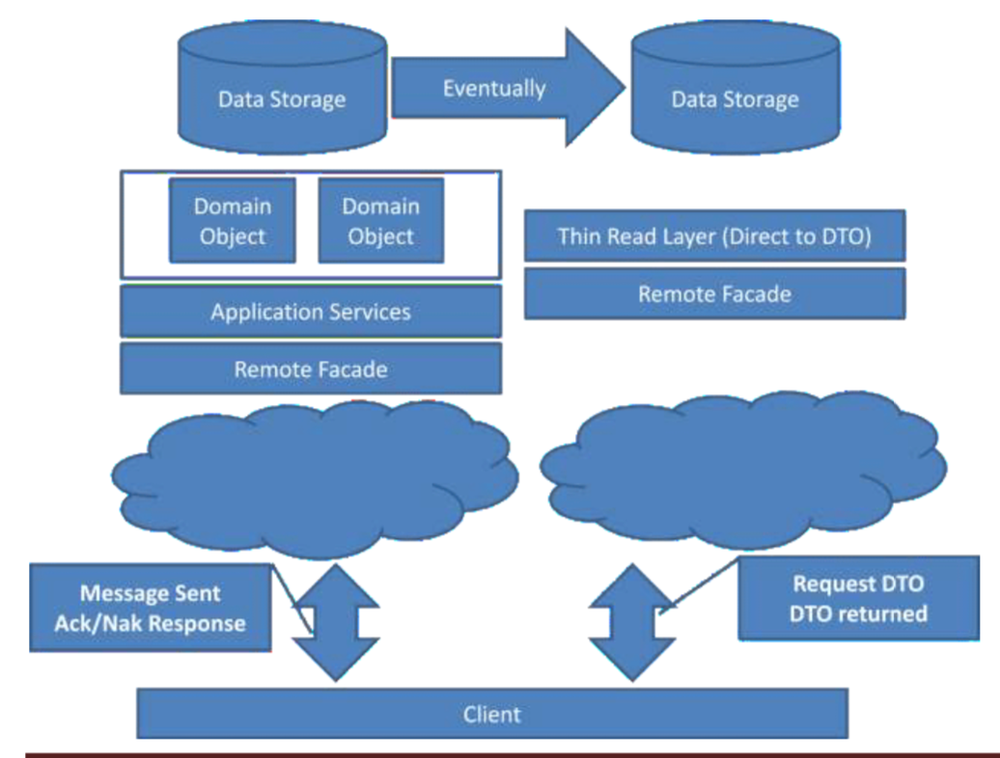

＃CQRS 
クエリとコマンドでシステムを分割する

## クエリ
責務: データを呼び出し側に返す

* 非正規化されたデータを取得したい場合が多い
* トランザクションが非常に多い
* クライアントへのデータ引き渡しはDTOを使う
* 一つの画面を作るのに、複数の送受信を行わないように、画面にマッチするDTOを作成する

__DTOはドメインモデルとは異なる__
* ページ番号やソート情報が必要
* 内部ステートを開示
* 集約ルートからDTOを作ろうとすると、集約の境界が複雑化する

## コマンド
責務: アクションを処理する

* トランザクション処理を使って正規化(第三くらいまで)したデータを格納する
* トランザクションは少ない

__DTOではなくドメインモデルを用いる__
* コマンドの処理にのみ焦点を当てることができる