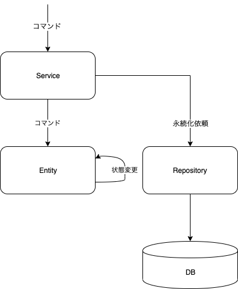
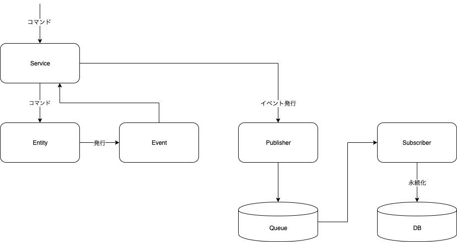

# EventSourcing
DDDの永続化周りで、EntityをそのままRepositoryを使ってDBに突っ込もうとすると、結構Entityとテーブルへのマッピングへのミスマッチが大変だよねっていう考え方。  
ミスマッチ・・・DDD(オブジェクト指向) <-> リレーショナルパラダイム  

ならば、ドメイン自体がイベントを発行することによって、永続化はさらに外に追いやってしまおうというやり方。

## リポジトリーパターンとの比較
従来のリポジトリーパターンは以下のようになる。  

発行されたコマンドを使ってEntity自体が自身の状態を変更し、serviceがリポジトリを使って永続化を行う。 __Enityが自身の状態を変更__ させるため、表現がぎこちなくなってしまう(と思う)。

イベントソーシングでは発行されたコマンドをもとに __Entityがドメインイベントを発行__ する。  

Entityの永続化の主体がRepositoryからEntityに移っているように表現できるので、よりドメインを明確に表現しやすい。

Service側から見ると
* Repository -> 変更されたEntityを永続化する
* EventSourcing -> Entityに発行されたドメインイベントをQueueに詰める(Publisherに渡す)

また、一つのコマンドに対して一つのイベントを発行すればいいだけなので __トランザクションの境界が小さくなる__ というより、サービスレベルでトランザクションをかけなくてよくなる。  
(一つのシナリオで一つのイベントの発行だけなので、複数の永続化処理を一つのシナリオでする必要がなくなる)

## 永続化での違い
リポジトリーパターンとイベントソーシングでは、永続化のタイミングが異なる。
リポジトリーパターンでは直接DBに書き込み、その結果を確認してからレスポンスを返すため、 __強整合性__ が担保される。  
イベントソーシングでは、ドメインイベントを発行できたタイミングでレスポンスを返し、DBへの永続化はSubScriberの実装次第となってしまうため、 __結果整合性__ のみ担保される。  
イベントソーシングでは即時結果が反映されるわけではないので、使い方には注意が必要となる。

## まとめ
DDDのドメインの表現をさらに洗礼できるよって感じ。それと、トランザクションが小さくなるのはすごいメリット。  
また、DBレベルでコマンド・クエリの分割ができるようになるため、分散して開発するのは結構よくなるかも。  
ただし、二つの橋渡しを果たすSubScriberがQueueについてもDB(永続化対象)についても知っとかないといけないので、実装負荷が高くなる。
それと、純粋に結果整合性しか担保できないのはデメリット。